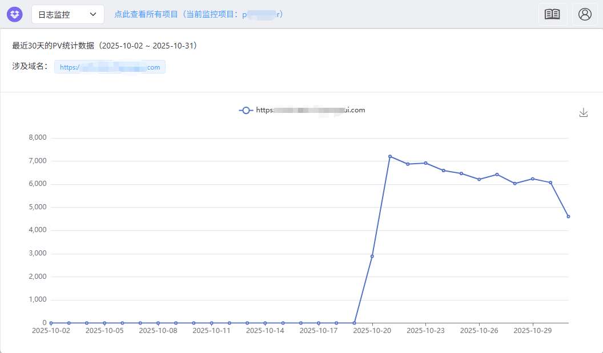
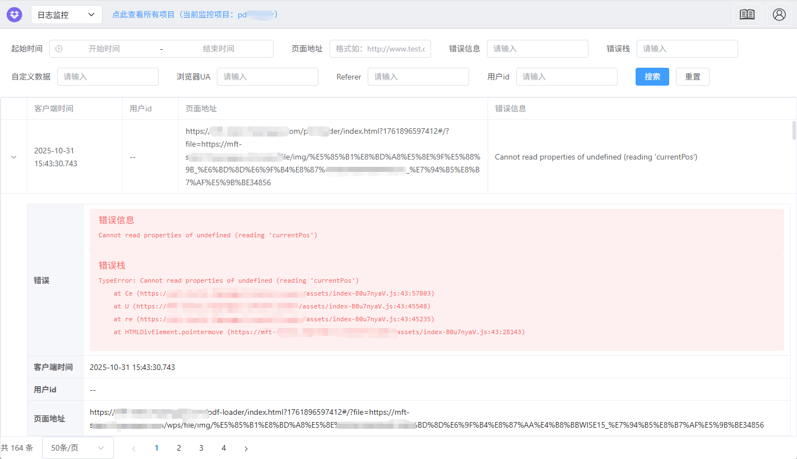

# better-monitor

<p align="center" style="display: flex;align-items: center;justify-content: center;gap:8px;">
  <a href="https://npmcharts.com/compare/better-monitor?minimal=true">
    
  </a>
  <a href="https://www.npmjs.com/package/better-monitor">
    
  </a>
  <a href="https://github.com/Yakima-Teng/better-monitor">
    
  </a>
  <a href="https://github.com/Yakima-Teng/better-monitor" target="_blank" rel="noopener noreferrer">
    
  </a>
  <a href="https://github.com/Yakima-Teng/better-monitor">
    
  </a>
</p>

**better-monitor** 是一个**完全零依赖**的前端日志监控SDK，用于帮助开发者快速集成前端监控功能，SDK 代码已完全开源在 [GitHub](https://github.com/Yakima-Teng/better-monitor)（如有帮助，请 star 支持一下😎）。

## ✨ 核心优势

- 🚀 **完全零依赖**：不依赖任何第三方库，体积小巧，加载速度快，避免依赖冲突
- 🔥 **错误监控**：支持捕获 JavaScript 报错：`error` 和 `unhandledrejection`
- 🔥 **API 监控**：支持拦截并记录基于 XMLHttpRequest 对象的接口请求/响应数据（支持 `axios`、`jQuery` 等库）
- 🔥 **行为日志**：记录用户操作日志，支持按时间顺序追踪用户行为
- 🔥 **访问统计**：自动记录访问统计数据：PV（页面访问量）、UV（独立访客数）和 BV（浏览器/操作系统访问量）
- 🔥 **埋点统计**：支持上报事件埋点查看统计信息
- 🔥 **性能测量**：提供时间测量功能，方便追踪性能问题

**注意**：该 SDK 需搭配后端服务使用。你可以参考项目文档自行实现后端服务，或者使用我们的[在线服务](https://www.verybugs.com/)（适合**访问量不大**的站点）。

## 相关链接

- [官方网站](https://www.verybugs.com)
- [API 文档](https://www.verybugs.com/doc.html)
- [GitHub 仓库](https://github.com/Yakima-Teng/better-monitor)
- [NPM 包](https://www.npmjs.com/package/better-monitor)

## 快速开始

### 方式一：CDN 引入（推荐）

```html
<script
  crossorigin="anonymous"
  src="https://cdn.verysites.com/verybugs/better-monitor/better-monitor.min.js"
></script>
```

```typescript
if ("BetterMonitor" in window) {
  // 初始化 SDK 参数
  window.BetterMonitor.init({
    // 替换成你的项目ID，其他可配置参数见 API 文档
    projectId: 999,
  });
}
```

**小技巧**

如果你只需要上报 JavaScript 错误日志和访问统计数据，只需一行代码即可完成集成，不需要写 JavaScript 代码（SDK 在检测到 `data-project-id` 属性后会自动调用 `window.BetterMonitor.init` 方法进行初始化）：

```html
<script
  crossorigin="anonymous"
  data-project-id="<你的项目ID>"
  src="https://cdn.verysites.com/verybugs/better-monitor/better-monitor.min.js">
</script>
```

### 方式二：NPM 安装

```bash
# 在项目里安装依赖 - 完全零依赖，无需担心版本冲突
npm install -S better-monitor
```

```typescript
import BetterMonitor from "better-monitor";

// 初始化 SDK 参数
BetterMonitor.init({
  // 替换成你的项目ID，其他可配置参数见 API 文档
  projectId: 999,
});
```

## 🎯 零依赖优势

better-monitor 采用完全零依赖设计，带来以下显著优势：

### 体积优势
- **极小的包体积**：压缩后仅几十KB，加载速度快
- **无额外依赖**：不会引入任何第三方库，避免依赖膨胀

### 兼容性优势
- **无版本冲突**：不会与项目中的其他依赖产生冲突
- **稳定可靠**：不依赖外部库，避免因第三方库更新导致的兼容性问题

### 安全性优势
- **代码透明**：所有功能都是自主实现，代码完全可控
- **安全可靠**：避免引入第三方库可能带来的安全风险

## 截图展示

<details>
<summary>点击展开查看 PV 统计截图</summary>
<br />



</details>

<details>
<summary>点击展开查看 JS 报错日志截图</summary>
<br />



</details>  

## 许可证

[MIT](LICENSE)
