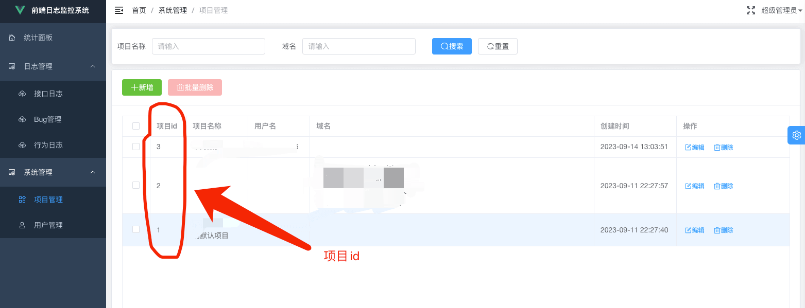
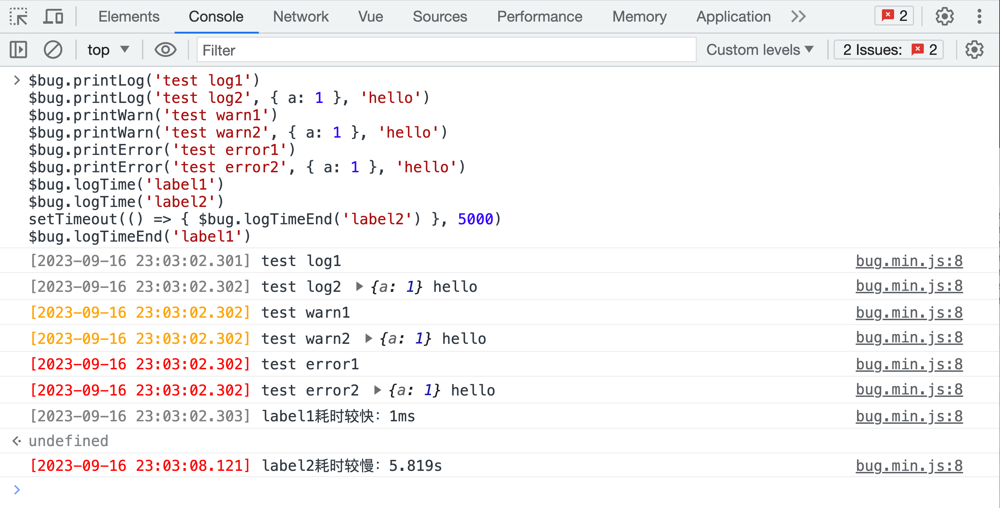
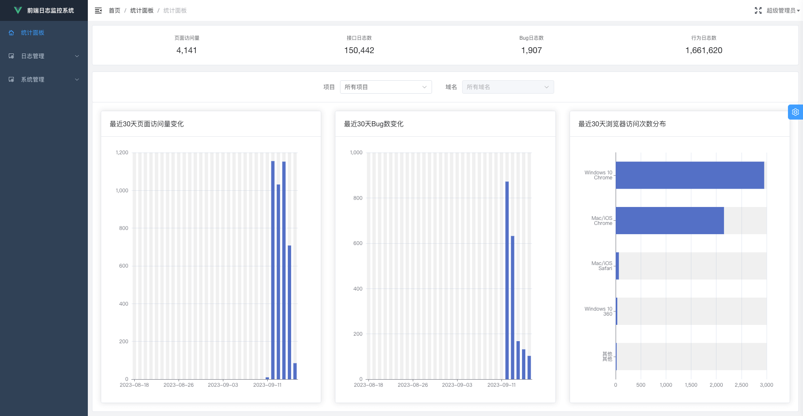
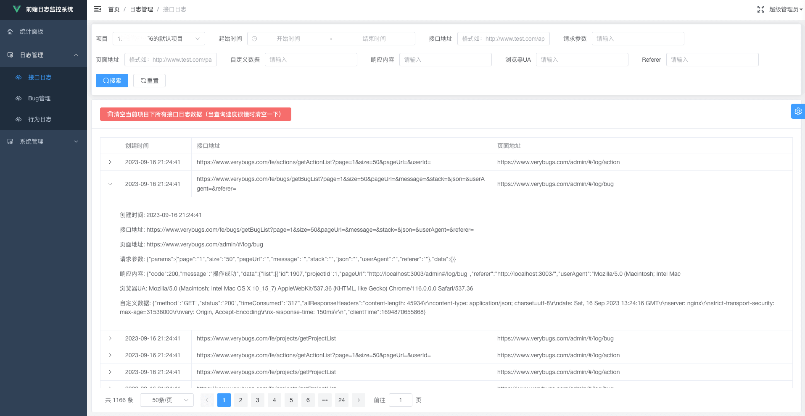
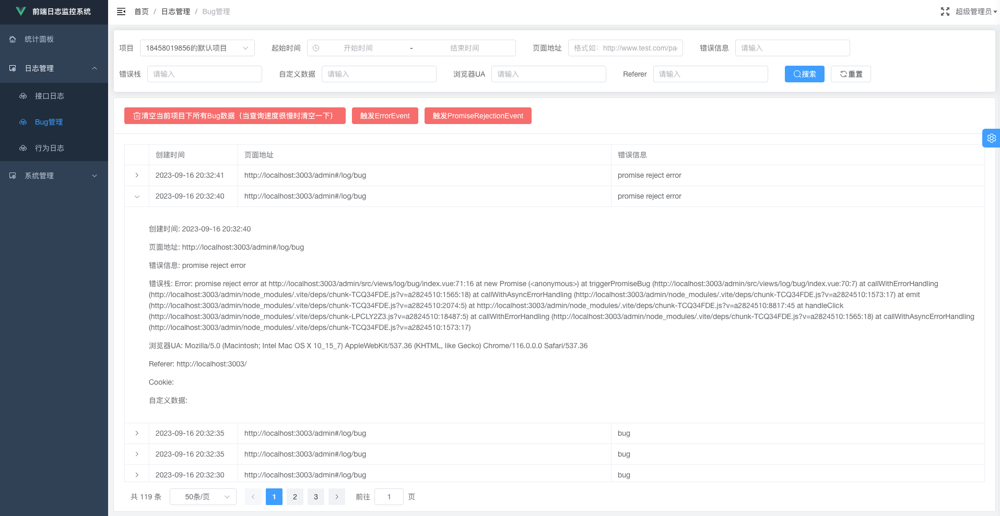
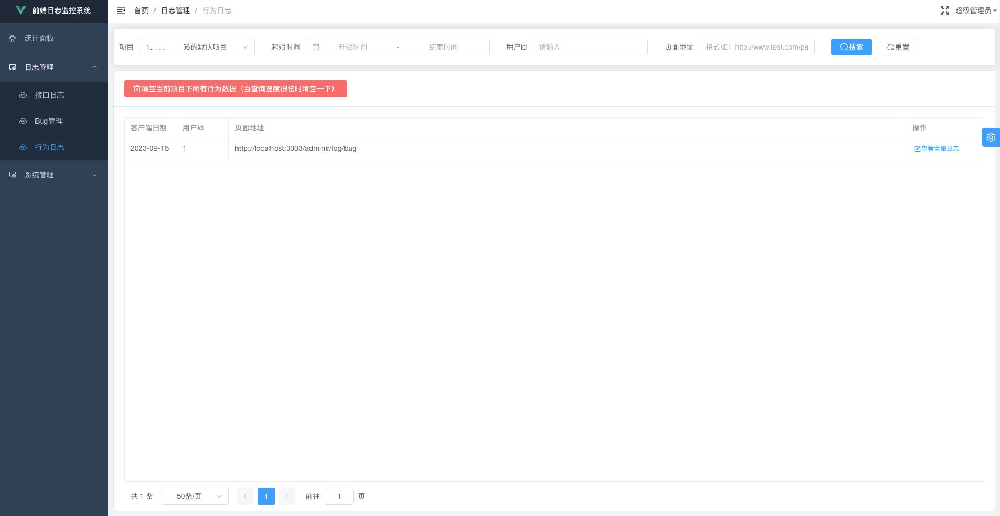
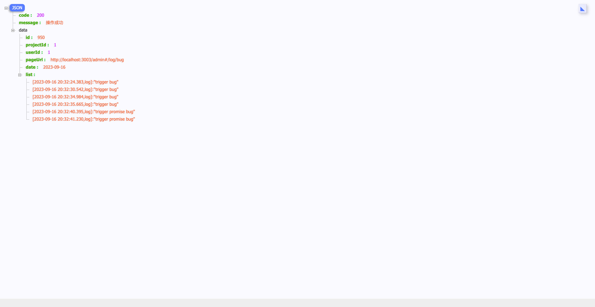
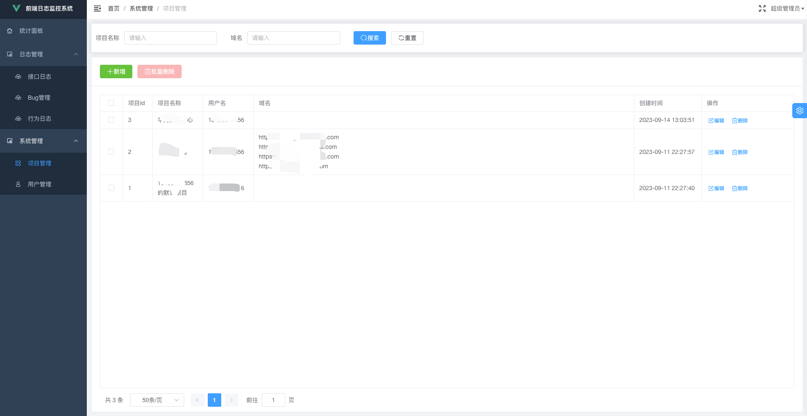

# better-monitor

<div align="center" style="display: flex;align-items: center;justify-content: center;gap:8px;">
  
</div>

<p align="center" style="display: flex;align-items: center;justify-content: center;gap:8px;">
  <a href="https://npmcharts.com/compare/better-monitor?minimal=true">
    
  </a>
  <a href="https://www.npmjs.com/package/better-monitor">
    
  </a>
  <a href="https://www.npmjs.com/package/better-monitor">
    
  </a>
</p>

[Click here for English document](./README_en.md).

> 用于向网站监控服务上传数据的前端JS SDK。

## 功能特性

- 🔥 上报 PV（page view） 数据。从而得知网站上哪些页面被访问得更频繁。
- 🔥 上报 UV（user view） 数据。从而得知有多少用户访问了你的项目。
- 🔥 上报 BV（browser view） 数据。从而得知用户使用哪些操作系统下的哪些浏览器来访问我们的项目。可以据此进一步确定网站的前端兼容性计划。
- 🔥 上报 AJAX 请求和响应数据。该 SDK 会自动拦截通过原生 XMLHttpRequest对象或者诸如 Axios 和 jQuery 等库触发的 AJAX 请求。可以据此查看哪些请求响应速度过慢。
- 🔥 上报 JavaScript 运行时报错数据。
- 🔥 上报用户行为数据（按时间顺序）。

## 如何使用

### 获取项目ID

首先，你需要注册并登录我们的[管理面板](https://www.verybugs.com/admin/)来获取项目ID。



### 集成SDK并进行配置

通过NPM将 better-monitor 作为项目依赖进行安装：

```bash
npm install -S better-monitor
```

然后按如下方式将我们刚刚获取到的项目ID配置进去即可：

```javascript
import BetterMonitor from 'better-monitor'

BetterMonitor.init({
  // fill in your project ID here
  projectId: 1,
})
```

**如果你的项目目前未使用NPM，也可以通过HTML Script标签来引入SDK，具体操作如下：**

说明：可以看到，项目ID是直接以data-project-id属性的方式配置到script元素上的。

```html
<!-- data-project-id 的值就是我们获取的项目ID -->
<script crossorigin="anonymous" data-project-id="1" src="https://cdn.jsdelivr.net/npm/better-monitor@0.0.5/dist/better-monitor.min.js"></script>
```

## API

该 SDK 对外暴露了几个实用的 API：

### BetterMonitor.printLog

`BetterMonitor.printLog` 和 `console.log` 几乎是一样的，除了以下几点：

- 输出的日志会在最前面显示一个日期前缀。
- 这些日志会被上报到服务端（日志级别为 `log` ），你可以在管理面板上进行查看。

```javascript
BetterMonitor.printLog('test')
BetterMonitor.printLog('test', { a: 1 }, 'hello')
```

输出如下：



### BetterMonitor.printWarn

与 `BetterMonitor.printLog` 类似，区别在于：

- 输出的文本颜色为棕黄色。
- 日志级别为 `warn`。

### BetterMonitor.printError

与 `BetterMonitor.printLog` 类似，区别在于：

- 输出的文本颜色为红色。
- 日志级别为 `error`.

### BetterMonitor.logTime, BetterMonitor.logTimeEnd

`BetterMonitor.logTime` 和 `BetterMonitor.logTimeEnd` 需要组合使用, 使用方法与 `console.time` 和 `console.timeEnd` 类似. 它们与 `console.time` 和 `console.timeEnd` 的区别在于：

- 如果开始和结束时间之间的间隔时长少于100ms，输出的日志会带有“耗时较快”文案。日志上报级别为 `log`。
- 如果开始和结束时间之间的间隔等于或大于100ms，输出的日志会带有“耗时较慢”文案。日志上报级别为 `error`。

从而可以方便地过滤出较慢的操作有哪些。

### BetterMonitor.init

初始化配置。一般进需要传入`projectId`参数。

```javascript
BetterMonitor.init({
  projectId: 1,
})
```

### BetterMonitor.addView, BetterMonitor.addBug

这些API很少会被用到，如确有需要，可以自行查看源码。

## 部分截图预览

**统计面板：**



**接口日志：**



**JS Bug日志：**



**用户行为日志列表：**



**用户行为日志文件：**



**项目管理：**



## 协议

MIT协议。
