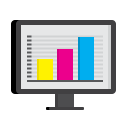

# better-monitor

  

> JS SDK used to report data to server for better log monitoring.

## Usage

todo.

## Features

- Report PV (page view) data. So you can know which pages are visited and among them which pages are the most commonly visited.
- Report UV (user view) data. So you can know how many users visited your project.
- Report BV (browser view) data. So you can know which OS (operating systems) and browsers are used to visit your project, and you can then define your frontend compatibility plan.
- Report api request and response data. Our sdk can monitor your AJAX request made with XMLHttpRequest, Axios and so on. So you can find which apis are slow in response time.
- Report JavaScript runtime bugs data.
- Report user actions data, in time order.

## License

MIT.
