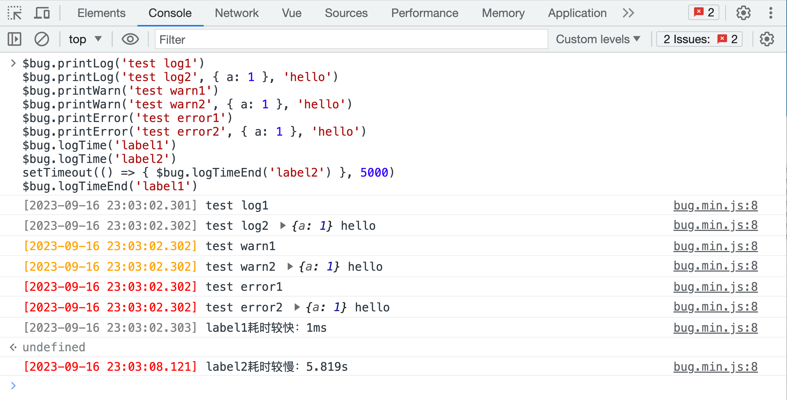

# API接口文档

这里我把API分为2组，一组是常用API，一组是冷僻API。一般来说，冷僻API你看都不要看😒。

## 一、常用API

### 1.1、$bug.printLog

::: tip 方法说明
打印日志，类似`console.log`，区别在于在控制台的输出中会带上日期时间字符串，并且相关日志会被采集上报（日志级别为`log`），方便后续在管理平台查看。
:::

使用方法和`console.log`一致。

```javascript
$bug.printLog('test')
$bug.printLog('test', { a: 1 }, 'hello')
```

实际效果见下图：



### 1.2、$bug.printWarn

打印日志，类似`console.warn`，使用方法和`$bug.printLog`一样，区别在于输入日志的颜色样式略有差异（棕黄色），以及采集上报后在管理平台显示的日志级别为`warn`。

使用方法见本文开头图片。

### 1.3、$bug.printError

打印日志，类似`console.error`，使用方法和`$bug.printLog`一样，区别在于输入日志的颜色样式略有差异（大红色），以及采集上报后在管理平台显示的日志级别为`error`。

使用方法见本文开头图片。

### 1.4、$bug.logTime和logTimeEnd

这两个方法需要组合使用。使用方法和`console.time`、`console.timeEnd`一样。
不同之处在于：
- 如果计算出来的耗时在100ms以内（不含），会输出`耗时较快`字样，并且采集上报后的日志级别为`log`。
- 如果计算出来的耗时超过了100ms（含），会输出`耗时较慢`字样，并且采集上报后的日志级别为`error`。

这样做区分处理是为了方便在日志中通过关键词找出耗时较慢的行为。

使用方法见本文开头图片。

## 二、冷僻API

### 2.1、$bug.addView

通常你不需要用到这个API。但如果你已经禁用了整体的PV、UV、BV（browser view的缩写，表示浏览器访问）统计功能，但是又想只针对特定页面上进行上报。可以使用该API。

注意：出于性能烤炉，该API调用后并不会立即进行上报，而是在达到一定日志量或者离开页面时才会进行批量上报。

```javascript
$bug.addView({
  // 必传字段
  pageUrl: location.href,
  // 可选字段，如果不传的话将UV统计功能将失效，因为无法区分用户（PV、BV统计功能正常可用）
  userId: 1,
})
```

### 2.2、$bug.addBug

通常你不需要主动调用该API。但如果有些错误你想要自行进行定制，可以自行`catch`后通过下面的方式主动进行上报。

注意：该API调用后会立即进行上报。

```javascript
$bug.addBug({
  pageUrl: location.href,
  message: '错误信息',
  stack: '错误栈信息',
  source: '来源信息，比如文件名、行号、列号等',
  type: '错误类型',
})
```

### 2.3、$bug.initSetting

使用示例如下，具体说明见下文中的注释文字。

```javascript
$bug.initSetting({
  // 非必传字段，黑名单，支持正则表达式和字符串，只要命中了blackList中的关键词，对应的接口日志、Bug日志、PV日志等都不会进行上报
  blackList: [
    /dev-[0-9]/,
    'blob',
    'https://www.example',
  ],
  // 非必传字段，获取用户id，请务必返回`string`或者`number`类型的值，支持返回`Promise<string | number>`
  getUserId() {
    // 一般建议直接在html入口文件中使用，以便尽可能早拿到数据，html入口文件里的Javascript代码一般不会走JS编译，所以最好用ES5语法书写
    var localData = localStorage.getItem('userId')
    // 这里我们在拿不到用户id的情况下，统一返回了0作为用户id
    return localData || 0
  },
})
```
