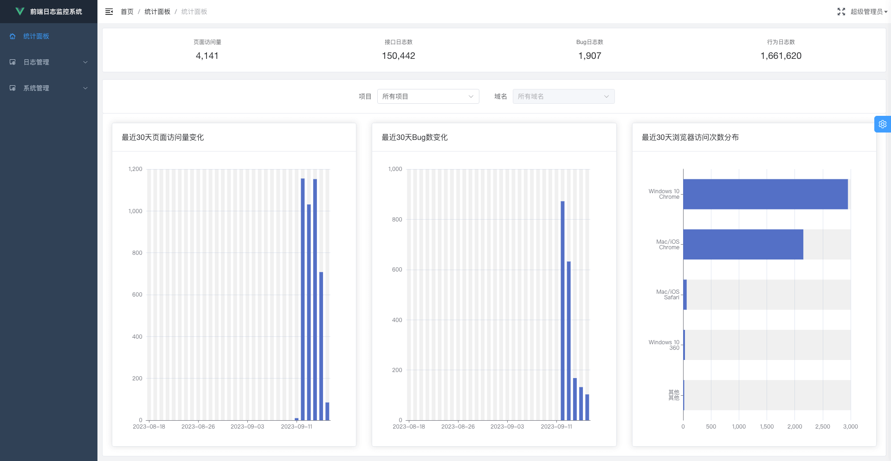
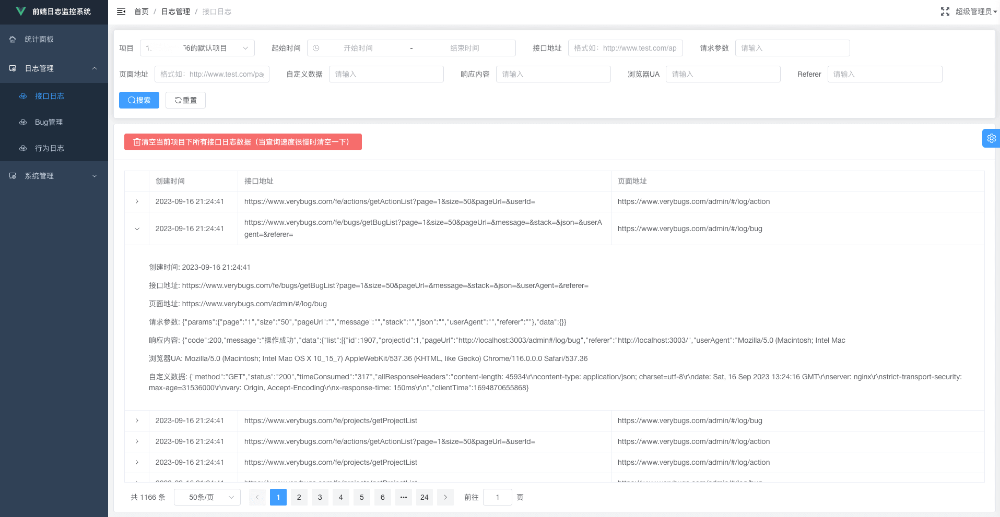
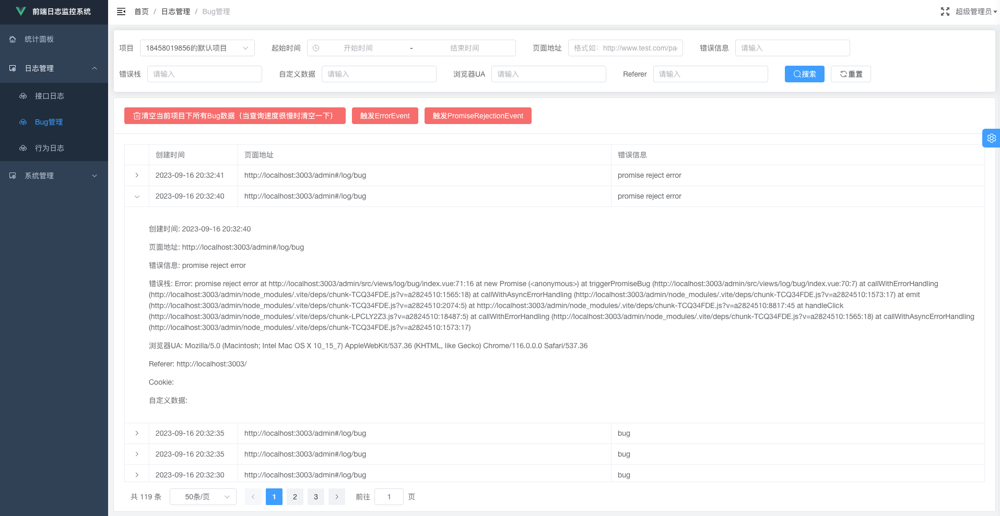
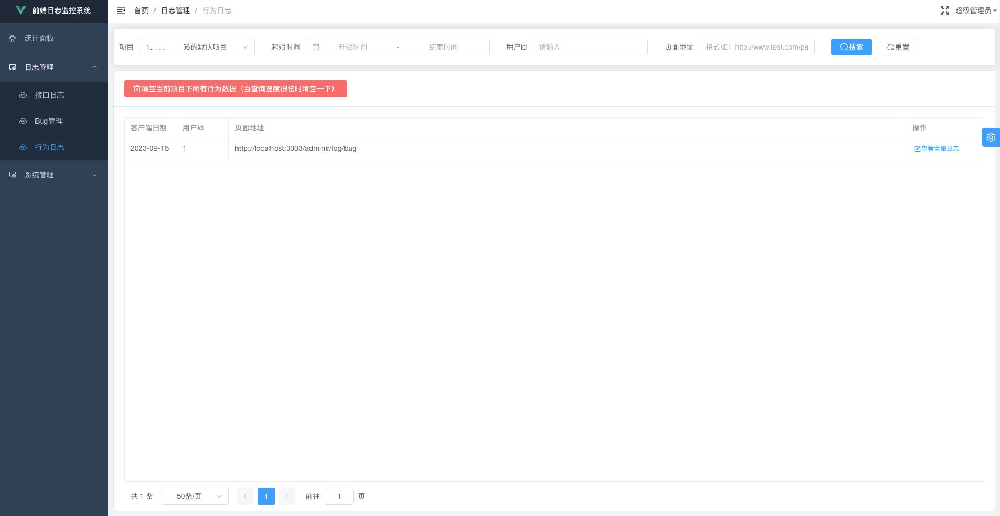
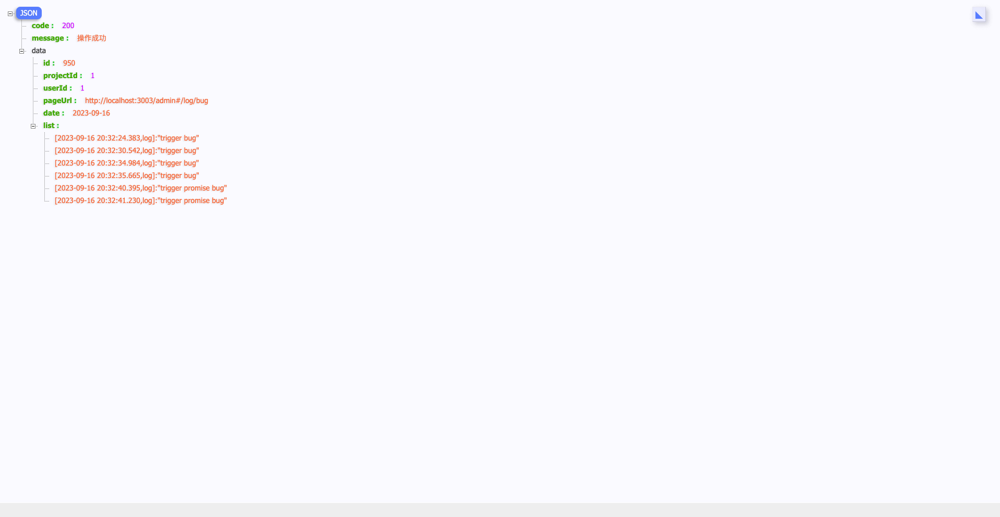
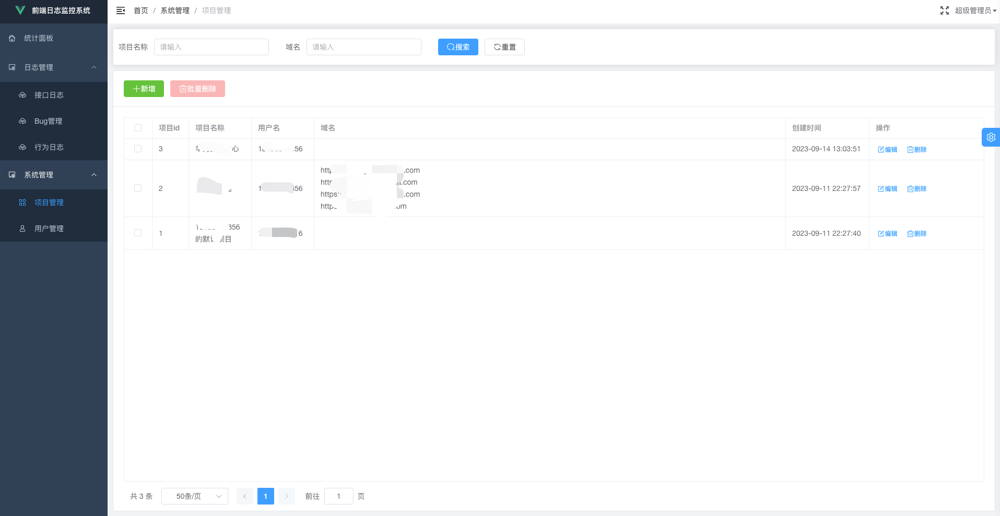

# 支持的功能

## PV等常用数据统计

可以查看各个项目的页面访问量、接口日志数、Bug日志数、行为日志数、最近30天页面访问量变化、最近30天Bug数变化、最近30天浏览器访问次数分布。

## 接口日志

可以查看前端项目中所有通过XHR触发的请求日志（主流的axios、jQuery等库都是通过XHR触发请求的），包括请求参数、响应内容等。

## Bug管理

可以查看前端项目中JS脚本运行时触发的所有报错，包括错误栈等信息。

## 行为日志

可以查看在前端项目中通过`$bug.printLog`、`$bug.printWarn`、`$bug.printError`3个方法打印的日志信息或者通过`$bug.logTime`、`$bug.logTimeEnd`2个方法打印的用时信息。

在上图，可以看到列表中右侧有**查看全量日志**按钮，点击后，可以看到类似下面这样的全量日志（同一个页面地址、同一个项目id、同一天内、同一个人触发的所有行为日志）。

## 项目管理

可以修改已有的项目信息，也可以新增项目。这样当你有多个项目时，可以区分查看不同项目下各自的日志信息。

