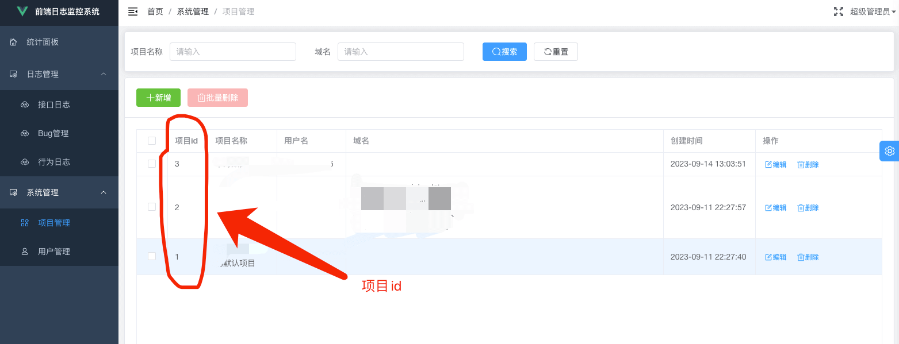

# SDK使用说明

> 该JS SDK的使用很简单，一共分2步。

::: tip 步骤
1. 申请项目id。
2. 引入SDK并进行配置。
:::

下面我们分步说明。

## 步骤一、申请项目id

登录后台管理系统（首次登录会自动进行注册，并需要进行邮箱验证，此后才可正常使用账号），在下图所示页面获取你的项目id（系统会给每个用户生成一个默认的项目id，你也可以自己新建）。



## 步骤二、引入SDK并配置

在项目的HTML入口页的`head`标签中引入JS SDK并进行配置。

```html
<script crossorigin="anonymous" data-project-id="1" src="https://www.verybugs.com/lib/better-monitor.min.js"></script>
```

你应该发现了，我们是通过`data-*`的方式传入配置项的，支持的配置项有下面这些（**通常只需要配置`data-project-id`属性即可**，其他属性可以忽略）：

- `data-project-id`: 必填项，将你在步骤一获得的项目id填到此处即可。
- `data-view`: 非必填项，默认为1，如设置为0，则不会统计PV、UV、浏览器访问情况等数据。
- `data-log`: 非必填项，默认为1，如设置为0，则不会上报接口请求记录。
- `data-error`: 非必填项，默认为1，如设置为0，则不会上报JS运行时错误。
- `data-action`: 非必填项，默认为1，如设置为0，则不会统计用户行为。
